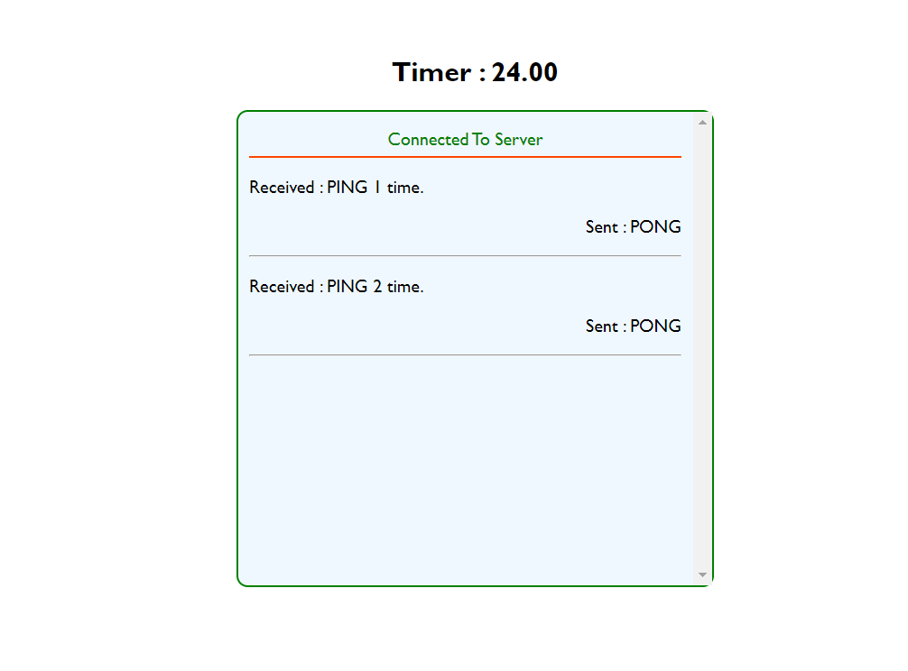
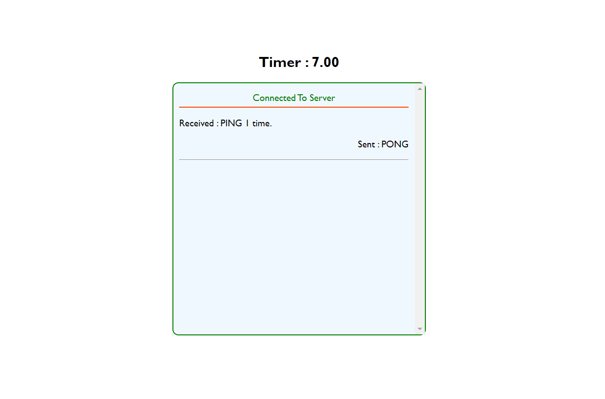

# WebSocket Server with Socket.io

This project demonstrates a WebSocket server built using Socket.io in Node.js.

## Prerequisites

- Node.js installed on your machine

## Installation

1. Clone this repository:

```bash
git clone https://github.com/Gaurav040399/primeTech
cd Backend
```

2. Install dependencies for the server:

```bash
npm install
```

3. Install dependencies for the client:

4. Open the index.html file on browser 

## Running the Server

1. Start the WebSocket server:

```bash
cd Backend
npm run server
```

This will start the server on http://localhost:8080.

## Running the Client

1. Open the index.html file on browser 

The client will connect to the server and respond to PING messages with PONG.

## Manual Disconnection

To manually disconnect the client, press `Ctrl + C` in the terminal where the client is running.

## API Endpoint

You can access the list of connected clients through the following endpoint:

- `GET /clients`: Returns a JSON object containing the IDs of connected clients.

Example:
```bash
curl http://localhost:8080/clients
```

## Additional Notes

- Adjust the server URL in `index.js` if the server is running on a different host/port.


## Product Preview



